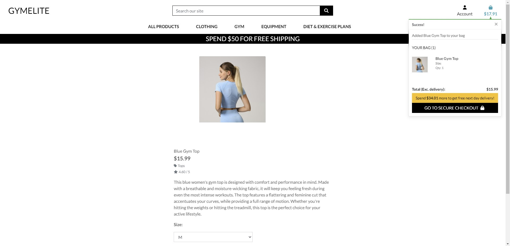
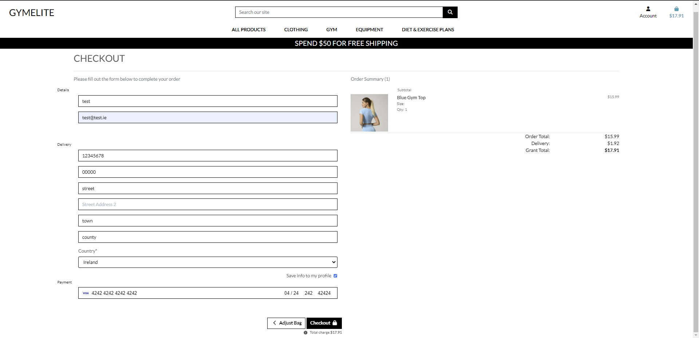
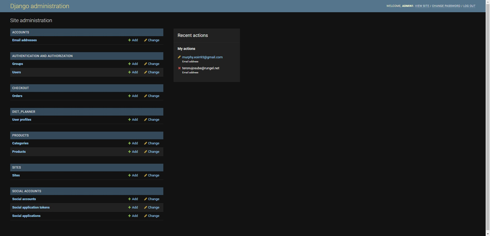

# GymElite

 ### GymELite is a one-stop shop for individuals looking to improve their physical fitness. It offers a wide range of high-quality workout gear and also provides customers with personalized diet and exercise plans. GymElite aims to provide customers with the tools and resources they need to achieve their fitness goals, in a convenient and accessible way.
---
---
## Features 

Gym Elite offers several key features to help users reach their fitness goals, including:

- __Landing Page__

  - A landing page that provides easy access to the product, shopping cart, and login pages, allowing users to quickly find the information they need. 

- __Products__

  - A product page that displays a grid of available products, making it easy for users to browse and choose the gear they need.

- __Product Added__ 

  - A pop-up notification that verifies when a product has been added to the user's shopping cart, with a link to the checkout page.

- __Cart__

  - A cart page that displays the contents of the user's cart, with options to keep shopping or move on to the secure checkout.

- __Checkout__

  - A checkout page that presents a form for shipping and billing details, allowing users to submit their order with confidence.

- __Order Confirmed__ 

  - An order confirmation page that provides details on the user's order and a pop-up notification in the top-left corner.

- __Admin__ 

  - An admin page with information on orders, user profiles, products, and categories.

### Future Plans

- Although the diet and exercise plans and user profiles are not yet fully implemented, I am dedicated to continuing work on Gym Elite to bring it to a place I can be proud of.

### Unfixed Bugs

- Sort bar in product view not working
- Sizes not showing in cart

## Deployment

- ### Deployment unsuccessful

- Static and media files have not loaded

- The site was deployed to GitHub pages. The steps to deploy are as follows: 
  - In the GitHub repository, navigate to the Settings tab 
  - From the source section drop-down menu, select the Master Branch
  - Once the master branch has been selected, the page will be automatically refreshed with a detailed ribbon display to indicate the successful deployment. 

The live link can be found here - [https://gymelite.herokuapp.com/]
