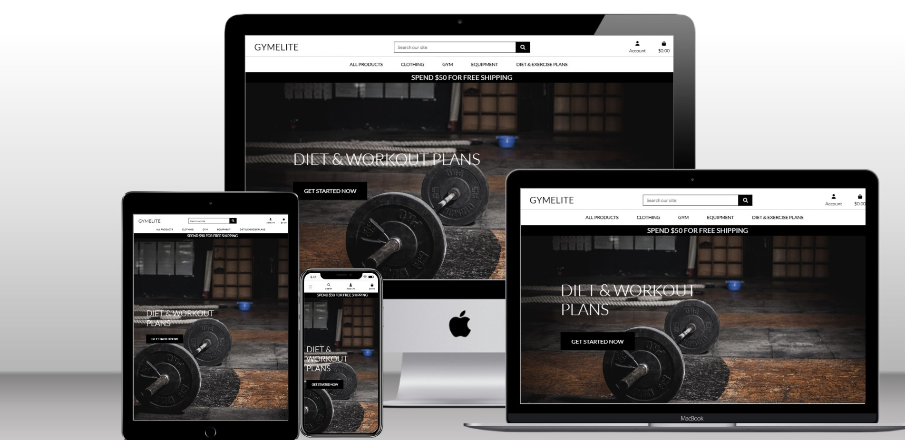
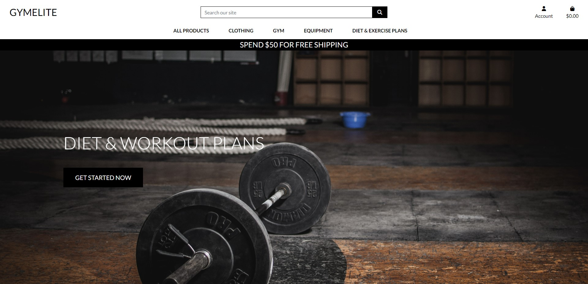
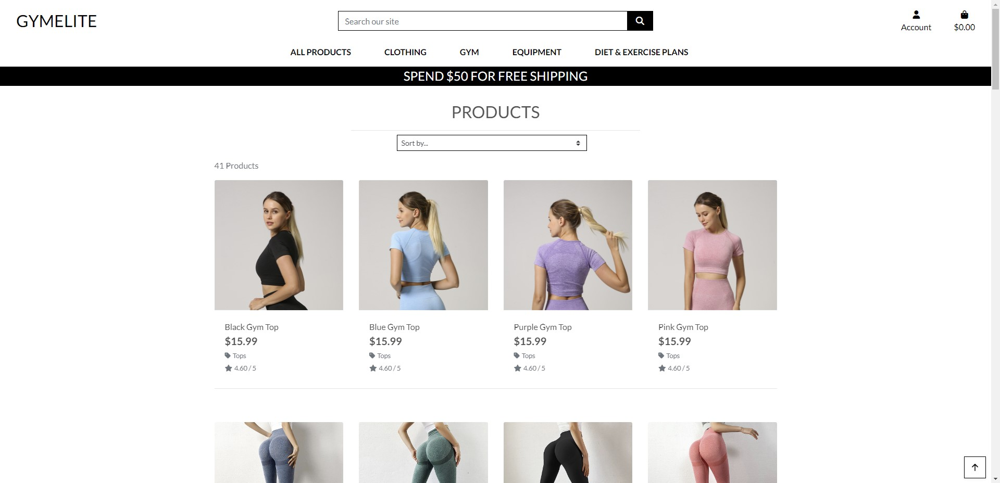

# GymElite

 ### GymELite is a one-stop shop for individuals looking to improve their physical fitness. It offers a wide range of high-quality workout gear and also provides customers with personalized diet and exercise plans. GymElite aims to provide customers with the tools and resources they need to achieve their fitness goals, in a convenient and accessible way.
---
## [View the deployed website here!](https://e01n.github.io/Good-Taco/)
---
## Features 

### Existing Features

- __Landing Page__

  - A simple yet effective homepage that gives users access to product, shopping cart and login pages
  - This section will allow the user to easily navigate to the section they desire across all devices. 

- __Products__

  - The product page gives users a grid display of the products available to purchase on the site.

- __Gallery Page__

  - I created an interactive gallery with an video slider showing videos of food.

- __Reservations Page__

  - The Reservation page gives the user the option to book a table at a said time and date and also the amout of people

- __The Footer__ 

  - The footer is situated on the bottom of all three pages to give the user access to the social media tags.
  - The footer section includes links to the relevant social media sites. The links will open a new tab to the relevant link to allow easy navigation for the user. 
  - The footer is valuable to the user as it encourages them to keep connected via social media.

### Features Left to Implement

- I couldn't get the reservations app to work correctly as i was having huge difficulties with django

### Unfixed Bugs

- I have had major issues with using django for the reservations. I understand that this is a huge part of the project and simply ran out of time to fix the errors i was encountering

## Deployment

- The site was deployed to GitHub pages. The steps to deploy are as follows: 
  - In the GitHub repository, navigate to the Settings tab 
  - From the source section drop-down menu, select the Master Branch
  - Once the master branch has been selected, the page will be automatically refreshed with a detailed ribbon display to indicate the successful deployment. 

The live link can be found here - [https://e01n.github.io/Good-Taco/]

## Further Comments
- There are limited comments on the development as i had originally started the project in a diffent file witch can be found on my github page
- I know that this project is not up the scatch. I had a lot of personal issues over the last couple of months with i let get in the way of my studies. I'm quite upset about this but i know that i can develop a better functioning site. I am going to keep working on this project for my portfolio and hopefully get it to a place where i am happy eith it. I am sorry that I didnt create a working version of this site. I will focus more on my studies in the future and not let my personal life get in the way. 